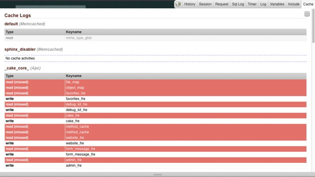

DebugKit Ex
===

**DebugKit Ex** is an extension for the CakePHP DebugKit plugin.  
For now, the only available panel is the Cache Panel, which display the cache activities.

Requirements
--
* [CakePHP 1.3 or older](http://http://cakephp.org/)
* [DebugKit Plugin](https://github.com/cakephp/debug_kit)

Install
--

###Install the plugin###

Drop the *DebugKitEx* folder in you *app/Plugin* directory, and load the extended panel, by editing your debugkit call (in your *AppController.php* probably)
	
	var $components = array('DebugKit.Toolbar' => array(
   	 'panels' => 'DebugKit.Cache'
	));

###Install the custom cache adapter###

Since redefining core class in a plugin is impossible, you have to drop the *Lib/Cache/Cache.php* file in you *Lib/Cache/* directory (create it if necessary). You application will use this Cache class instead of the one in the core, and the main benefit is that you don't need to change anything in your calls to the Cache class.  
This class implements additionals method to logs the cache activities.

Available panels
--

###Cache###

